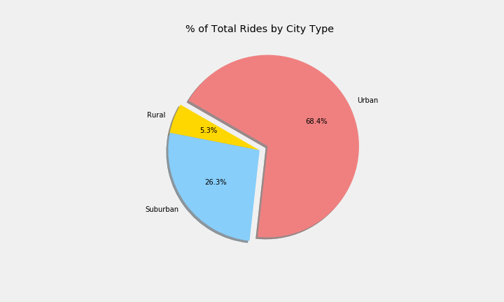

# PyBer_Analysis
Uses pandas to parse through data about cities (urban/ suburban/ rural), drivers, and riders in order to extract and organize data. Analysis includes (by city type): average fare per ride/ driver/ city, % of total fares/ rides/ drivers, and average fares per week. Uses matplotlib to load data into charts based on groupings.
## Resources
Resources included data about drivers and ride-id's. 
- <Resources/city_data.csv>
- <Resources/ride_data.csv>
## Discoveries

As is seen in the image below, the Urban city type has the highest percentage of total rides out of the three city types. They also have the highest number of drivers, and the highest average number of drivers per city.

 
 ---
 In rural areas, the average fare per city and the average fare per driver are both higher. It is likely that due to the potential of driving long distances in sparsely populated areas, the quantity of drivers in rural areas is lower and the cost of travel is raised.   
    
# Summary DataFrame
From the summary dataframe, we can see that the total volume of rides, and consequently the total fares collected, are higher in the urban city type. However, the average fare per ride is lower in these urban areas, likely due to a shift to the right in the quantity supplied. The price goes down, and therefore, we see the average fare per driver is noticeably lower in urban areas. We can also see that the total number of drivers is larger than the total number of rides, resulting in the average fare per driver being lower than the average fare per ride for urban cities.
    
# Total Fare by City Type
For a final representation of the data, the line graph tells the story of the average fare by city type. It was calculated per week and represented over a 4-month period (Jan-May). The data suggests that late February is a relative max for average fare, and that January holds a relative minimum. This can be interpreted for travellers wishing to find total costs of travel as well as for drivers/ employers trying to read the general climate of their market in this 4-month period.

