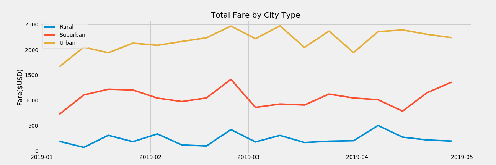

# PyBer_Analysis
Uses pandas to parse through data about cities, drivers, and riders in order to extract and organize data. Then uses matplotlib and create charts.
## Discoveries

As is seen in the image below, the Urban city type had the highest percentage of total rides out of the three city types. They also had the highest number of drivers, and the highest average number of drivers per city.

 
 ---
 In terms of fare, the average fare per city for rural areas is higher as well as the average fare per driver for rural areas. This is due to the quantity of drivers being lower in rural areas as well as the higher cost of travel.
 
# Summary DataFrame
From the summary dataframe, we can see that the total volume of rides and consequently the total fare value was higher in the urban city type. However, the average fare per ride was lower in these Urban areas, likely due to a shift in the quantity supplied. Therefore, the average fare per driver was noticeably lower. We can also see that the total number of drivers is larger than the total number of rides, which results in the average fare per driver being lower than the average fare per ride for urban cities.
 
# Total Fare by City Type
For a final representation of the data, the line graph tells the story of the average fare by city type. It was calculated per week represented over a 4 month period (Jan-May). The data suggests that late February is a local max for average fare, and that January holds a relative minimum. This can be interpreted for travellers wishing to find total costs of travel as well as for drivers/ employers trying to read the general climate of their market.

